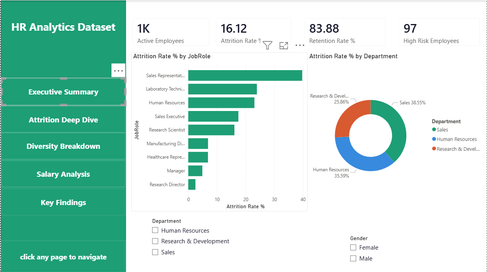

# HR Analytics Dashboard 📊
### Power BI | IBM HR Attrition Dataset | DAX | Power Query | Data Modeling

---

## Overview

An interactive Power BI dashboard analyzing employee attrition, diversity, salary trends, and headcount using the IBM HR Analytics Employee Attrition dataset. Built to simulate a real-world HR analytics solution that helps HR managers make data-driven decisions on employee retention and workforce planning.

---

## Dashboard Pages

### 1. Executive Summary


High-level KPIs and attrition overview across departments and job roles.

### 2. Attrition Deep Dive


Detailed breakdown of attrition by tenure band, age group, and department/role matrix with conditional formatting heatmap.

### 3. Diversity Breakdown


Gender split, education field distribution, age group histogram, and Gender × Department clustered analysis.

### 4. Salary Analysis


Average salary by department and job level, salary vs job satisfaction scatter plot, and salary gap between employees who left vs stayed.

### 5. Key Findings


Data-driven insights and HR recommendations derived from the analysis.

---

## Key Insights from the Data

- **Sales Representatives** have the highest attrition at **39.8%** — nearly 2.5x the company average of 16.1%
- Employees working **Overtime** are **30%+ more likely** to leave than those without overtime
- Employees earning **under $3K/month** leave at **2x the rate** of those earning above $6K/month
- **New joiners (0–1 year tenure)** account for the highest attrition at **31.2%** — first year is most critical
- **Low job satisfaction (score 1)** has 22.8% attrition vs only **11.3% for high satisfaction (score 4)**
- The **25–34 age group** faces the highest attrition — early career employees are most at risk
- Salary gap between leavers and stayers is **$2,050/month** — compensation is a key retention driver

---

## Technical Skills Demonstrated

| Skill | Details |
|---|---|
| **Power Query** | Data cleaning, removing redundant columns, custom Age Group and Salary Band columns, data type corrections |
| **Data Modeling** | Star schema — split into 3 tables (Demographics, JobInfo, Compensation) linked by EmployeeNumber with 1:1 relationships |
| **DAX Measures** | 7 custom measures including Attrition Rate %, Retention Rate %, High Risk Employees, Salary Gap, Female % |
| **DAX Columns** | Tenure Band calculated column using SWITCH logic |
| **Custom Visuals** | Scatter plot, Matrix with conditional formatting heatmap, Donut chart, Line chart |
| **UX/UI Design** | Custom teal theme, navigation bar with page navigation buttons, consistent layout across all pages |
| **Mobile Layout** | Mobile-optimized layout created for key visuals |

---

## Custom DAX Measures

```dax
-- Attrition Rate %
Attrition Rate % =
VAR AttritionCount =
    COUNTROWS(FILTER('Employee_Compensation',
        'Employee_Compensation'[Attrition] = "Yes"))
VAR TotalEmployees = COUNTROWS('Employee_Compensation')
RETURN DIVIDE(AttritionCount, TotalEmployees, 0) * 100

-- High Risk Employees (Low satisfaction + Overtime, still active)
High Risk Employees =
VAR HighRiskIDs =
    SELECTCOLUMNS(
        FILTER('Employee_JobInfo',
            'Employee_JobInfo'[OverTime] = "Yes"),
        "ID", 'Employee_JobInfo'[EmployeeNumber])
RETURN
COUNTROWS(
    FILTER('Employee_Compensation',
        'Employee_Compensation'[JobSatisfaction] <= 2 &&
        'Employee_Compensation'[Attrition] = "No" &&
        'Employee_Compensation'[EmployeeNumber] IN HighRiskIDs))

-- Salary Gap (Stayed vs Left)
Salary Gap (Left vs Stayed) =
VAR AvgLeft = CALCULATE([Avg Monthly Salary],
    'Employee_Compensation'[Attrition] = "Yes")
VAR AvgStayed = CALCULATE([Avg Monthly Salary],
    'Employee_Compensation'[Attrition] = "No")
RETURN AvgStayed - AvgLeft
```

---

## Data Model — Star Schema

```
Employee_Demographics (center)
    ├── EmployeeNumber (1:1) → Employee_JobInfo
    └── EmployeeNumber (1:1) → Employee_Compensation
```

Three tables linked by EmployeeNumber with bidirectional cross-filter:
- `Employee_Demographics` — Age, AgeGroup, Gender, Education, MaritalStatus
- `Employee_JobInfo` — Department, JobRole, JobLevel, OverTime, TenureBand
- `Employee_Compensation` — MonthlyIncome, SalaryBand, Attrition, JobSatisfaction

---

## Dataset

**IBM HR Analytics Employee Attrition Dataset**
- Source: [Kaggle](https://www.kaggle.com/datasets/pavansubhasht/ibm-hr-analytics-attrition-dataset)
- 1,470 employee records
- 35 features including demographics, job info, compensation, and satisfaction scores
- Created by IBM data scientists for HR analytics practice

---

## Tools Used

- **Power BI Desktop** — dashboard development
- **Power Query** — data transformation and cleaning
- **DAX** — custom measures and calculated columns
- **Excel** — initial data inspection

---

## Project Structure

```
HR-Analytics-PowerBI/
│
├── HR_Analytics_Dashboard.pbix    ← Power BI file
├── README.md                      ← this file
│
├── dataset/
│   └── WA_Fn-UseC_-HR-Employee-Attrition.csv
│
├── images/
│   ├── page1_executive_summary.png
│   ├── page2_attrition_deepdive.png
│   ├── page3_diversity_breakdown.png
│   ├── page4_salary_analysis.png
│   └── page5_key_findings.png
│
└── theme/
    └── hr_theme.json
```

---

