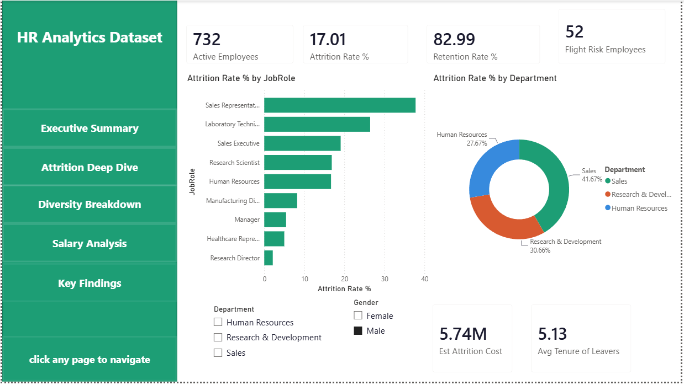
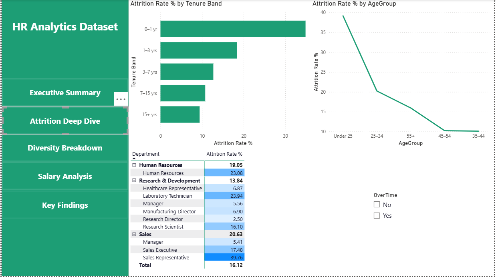
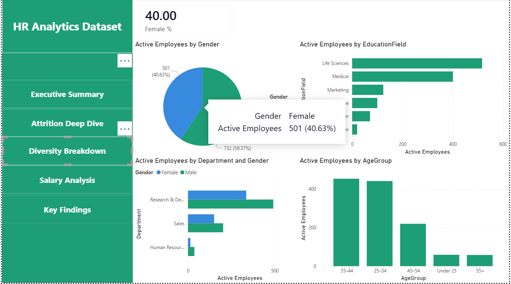
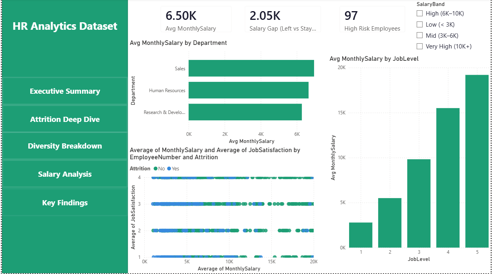
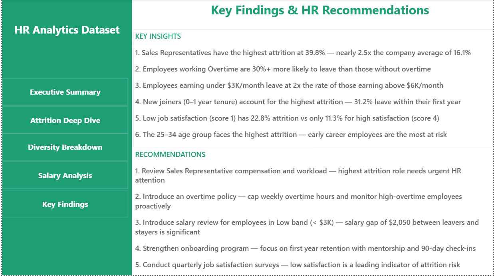

# HR Analytics Dashboard 📊
**Power BI · IBM HR Dataset · DAX · Power Query**

---

## What is this?

I built this dashboard to understand what actually drives employees to leave a company. The IBM HR Attrition dataset has 1,470 employee records with 35 columns — everything from salary and job satisfaction to overtime and distance from home. I wanted to see which of these actually mattered.

The result is a 5-page interactive dashboard that HR teams can use to spot problems before they become expensive.

---

## Pages

### 1. Executive Summary


The first thing you see — overall attrition rate, how many people are flight risks right now, estimated cost of attrition, and a breakdown by department and job role. I replaced the standard "High Risk" card with a custom Flight Risk measure that's more precise.

### 2. Attrition Deep Dive


This is where the interesting stuff is. I looked at attrition by tenure band, age group, and built a matrix table showing every department and role side by side. The overtime slicer on this page is the most revealing filter — switch it on and every number jumps.

### 3. Diversity Breakdown


Gender split, education background, age distribution, and how gender maps across departments. Nothing shocking here but useful context for the attrition numbers.

### 4. Salary Analysis


Average salary by department and job level, a scatter plot of salary vs job satisfaction colored by attrition, and the salary gap between people who left vs people who stayed. The $2,050/month gap was the number that surprised me most.

### 5. Key Findings


What I actually found from the data — written as insights and recommendations, not just chart descriptions.

---

## What I found

- Sales Representatives leave at **39.8%** — that's nearly 2.5x the company average of 16.1%
- People on overtime are **30%+ more likely** to quit — the overtime slicer on Page 2 makes this very visible
- Employees earning under $3K/month leave at **twice the rate** of those above $6K
- First-year employees are the most vulnerable — **31.2% attrition** in the 0–1 year tenure band
- The company is losing an estimated **$5.74M per year** to attrition (6 months salary per leaver)
- Right now **52 active employees** show flight risk signals — low satisfaction + overtime
- Average leaver stays **5.13 years** before leaving — so this isn't just a new-joiner problem

---

## How I built it

### Data Cleaning — Power Query
- Removed 3 useless columns that had the same value in every row (EmployeeCount, Over18, StandardHours)
- Added an **Age Group** column to bin ages into readable brackets
- Added a **Salary Band** column to group salaries into 4 tiers
- Fixed data types — EmployeeNumber as Text (it's an ID), MonthlyIncome as Decimal

### Data Model — Star Schema
Rather than keeping one flat table, I split the data into 3 separate tables linked by EmployeeNumber:

```
Employee_Demographics (center)
    ├── EmployeeNumber (1:1) → Employee_JobInfo
    └── EmployeeNumber (1:1) → Employee_Compensation
```

- `Employee_Demographics` — Age, AgeGroup, Gender, Education, MaritalStatus
- `Employee_JobInfo` — Department, JobRole, JobLevel, OverTime, TenureBand
- `Employee_Compensation` — MonthlyIncome, SalaryBand, Attrition, JobSatisfaction

### DAX Measures

The standard ones (attrition rate, retention rate, active employees) plus three I wrote myself that aren't in other HR dashboards:

**Est Attrition Cost** — multiplies number of leavers by average salary × 6 months. Gives HR a dollar figure to justify retention investment.
```dax
Est Attrition Cost = 
COUNTROWS(
    FILTER('Employee_Compensation',
        'Employee_Compensation'[Attrition] = "Yes")
) * AVERAGE('Employee_Compensation'[MonthlyIncome]) * 6
```

**Flight Risk Employees** — counts active employees who are dissatisfied AND on overtime. These are the people most likely to leave next.
```dax
Flight Risk Employees = 
VAR ot_staff =
    SELECTCOLUMNS(
        FILTER('Employee_JobInfo', 'Employee_JobInfo'[OverTime] = "Yes"),
        "emp_id", 'Employee_JobInfo'[EmployeeNumber]
    )
RETURN
COUNTROWS(
    FILTER(
        'Employee_Compensation',
        'Employee_Compensation'[Attrition] = "No" &&
        'Employee_Compensation'[JobSatisfaction] <= 2 &&
        'Employee_Compensation'[EmployeeNumber] IN ot_staff
    )
)
```

**Avg Tenure of Leavers** — how long employees typically stay before leaving. Helps identify whether this is an early-career or mid-career retention problem.
```dax
Avg Tenure of Leavers =
CALCULATE(
    AVERAGE('Employee_JobInfo'[Tenure(Years)]),
    FILTER(
        ALL('Employee_Compensation'),
        'Employee_Compensation'[Attrition] = "Yes"
    )
)
```

---

## Dataset

IBM HR Analytics Employee Attrition — [Kaggle link](https://www.kaggle.com/datasets/pavansubhasht/ibm-hr-analytics-attrition-dataset)

1,470 employees · 35 columns · created by IBM data scientists

---

## Tools

Power BI Desktop · Power Query · DAX · Excel (initial data check)

---

## Repo structure

```
HR-Analytics-PowerBI/
├── HR_Analytics_Dashboard.pbix
├── README.md
├── dataset/
│   └── WA_Fn-UseC_-HR-Employee-Attrition.csv
├── images/
│   ├── executive_summary_update.png
│   ├── attrition_deepdive.png
│   ├── diversity_breakdown.png
│   ├── salary_analysis.png
│   └── key_findings.png
└── theme/
    └── hr_theme.json
```

---
